# Project Manager 
the intent for this project was to be able to keep it on you desktop at all times so I made the ui mostly transparent so you can just place it on your screen<br>
it also stores data in project folder so if you have a friend with the same project manager they can edit it and look at it too. I also plan to add GitHub to it would also make that easier<br>
<br>
the story behind this things development is wild I was learning qml so I worked on the ui for like a week then i for got about it for like 2 month. in those 2 months I got a lot better at qml then I came back to this and made like the entire thing in 60hr within a week

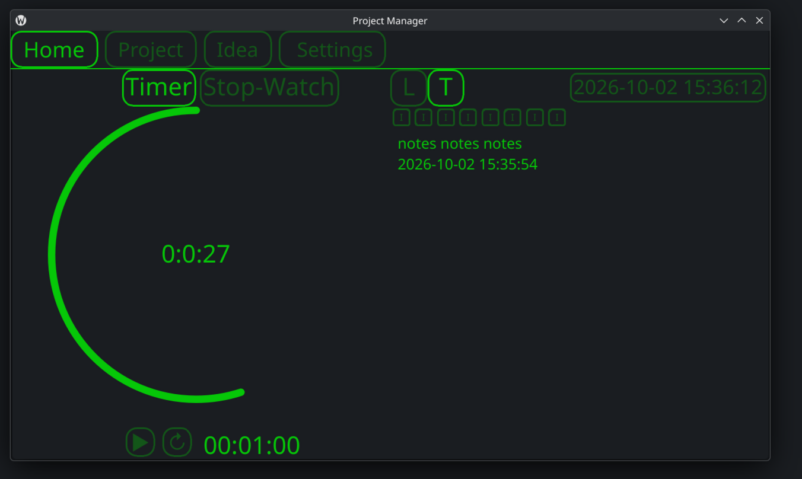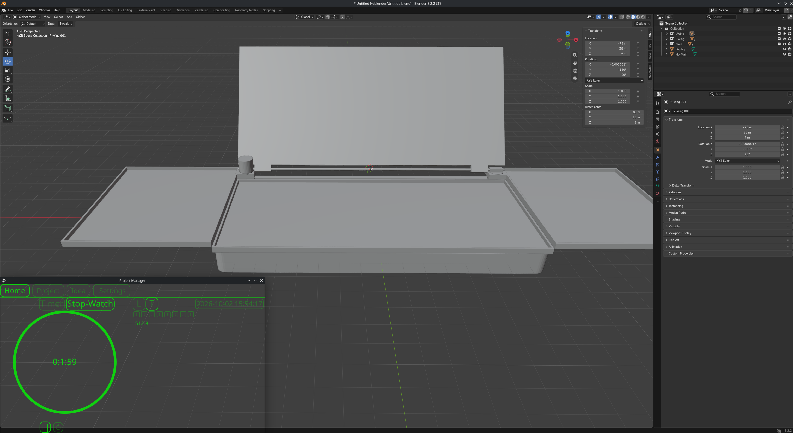
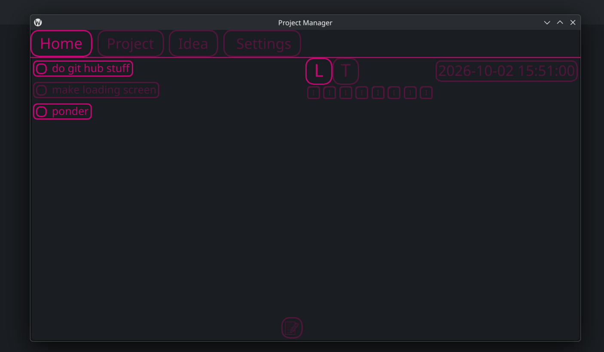


***
## projects
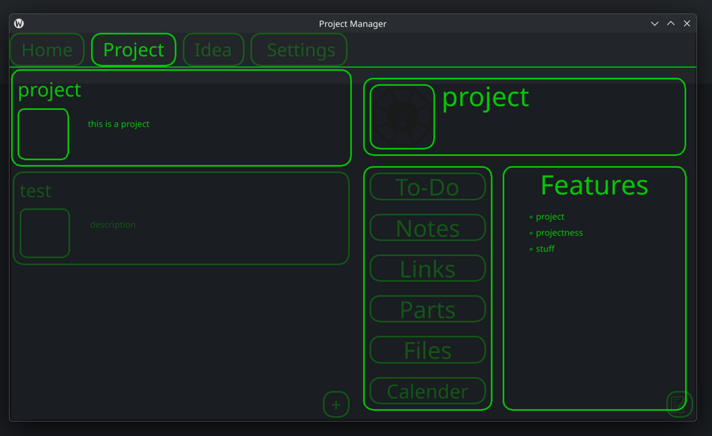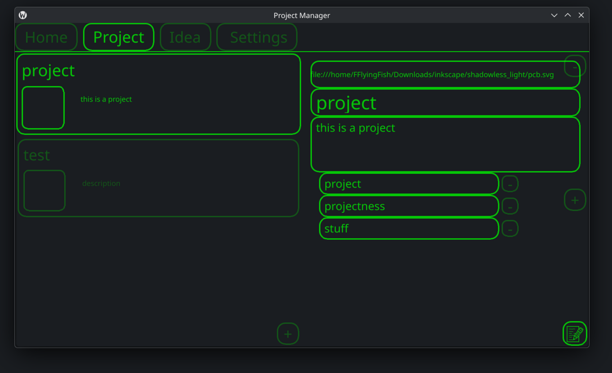<br>
* in order for data to save you need to make a JSON in your project root folder(better instructions in the technical features)
### name
* stores the name of the task
* this loads on to the task and on to all the pages for the task
* can be edited on the projects page it is the middle box
### description
* you can have a small description on your task
* it can be edited in the projects menu in the large text box
### logo
* so I was trying to make the logo change colors with the manager, but it didn't work so you can add a logo it just doesn't look good
* you can edit it in the project page with a drop area where you can just drop an image
### project features 
* this is a list of features and constraints to help you visual what you need your project to do
* this can be edited in the project page on the right side of the page there is an add button that will "add" one feature that you can edit
* you can delete a feature just by clicking the "-" button next to them
### To-Do
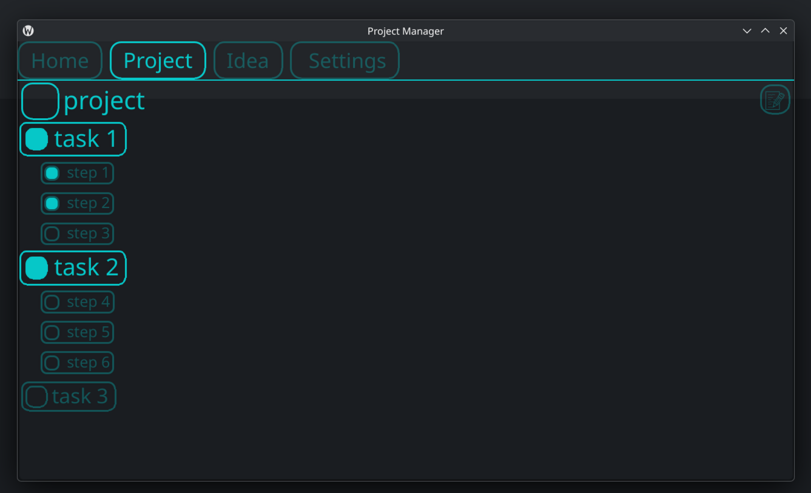<br>
* after you select your project you can go to the to do list page
* this page is for you to store every thing you need to do inorder for the project to be complete 
* you can enter edit mode with the "📝" button
#### task
* a task will store 3 things
  * bool: is the task done
  * string: the name of the task
  * vector: all the sub-tasks
* if you click on a task it will expand to show all the sub-tasks inside of it
* you can edit them in the edit mode
* you can click the "+" at the bottom to add a task
* you can click the "-" next to the task to delete it
#### subtask
* a subtask only stores a name and if it is done or not
* you can add a subtask to a task while in the edit mode
* you click the "+" button next to the task you want to add it too
* you can click the  "-" button next to a subtask to delete it
### notes
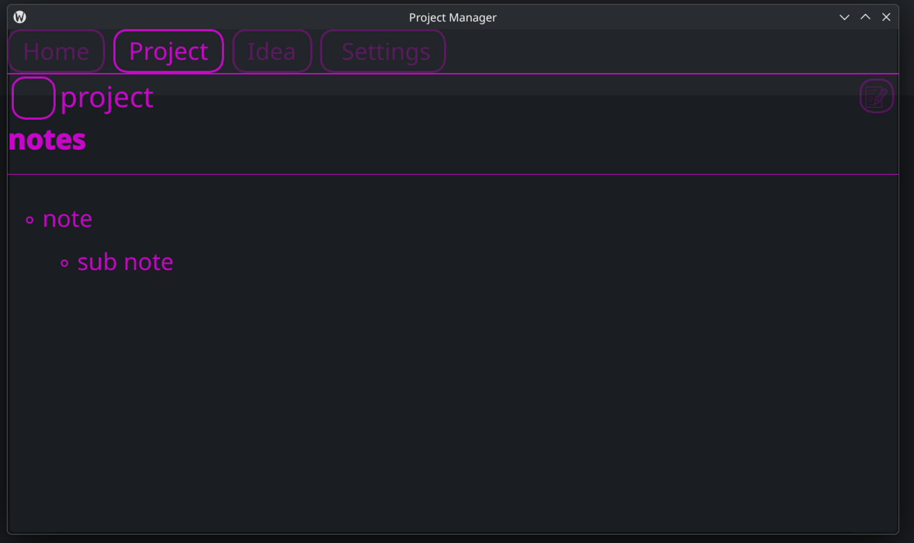<br>
* the notes can be used to store basically anything you want
* it uses mark down styling like GitHub
### links
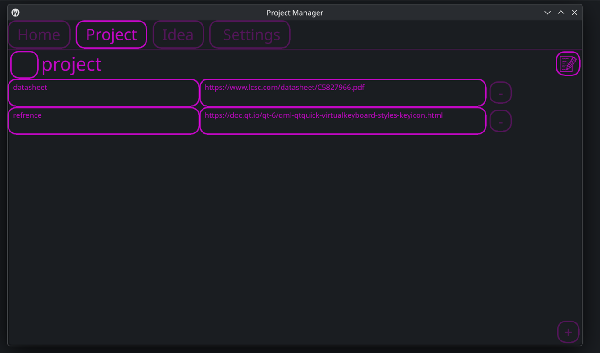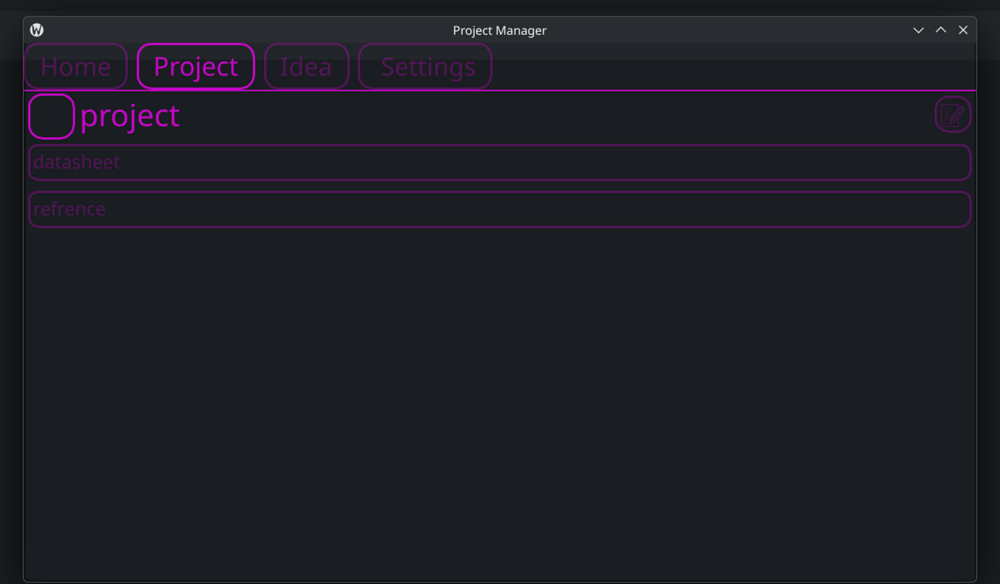
* this is used to store any important links you need for your projects
* if you click on a link it will open the link 
* you also give the links names so it is easier to remember what each link is
* you can edit the links by clicking the "📝" button
* you can add a link with the "+" button and remove one with the "-"
* the left text box is the name and the right text box is the link
### parts
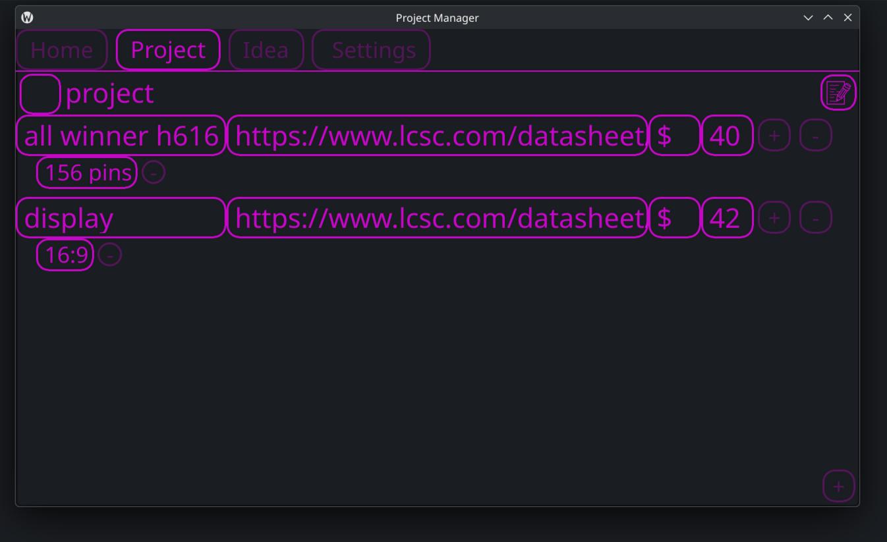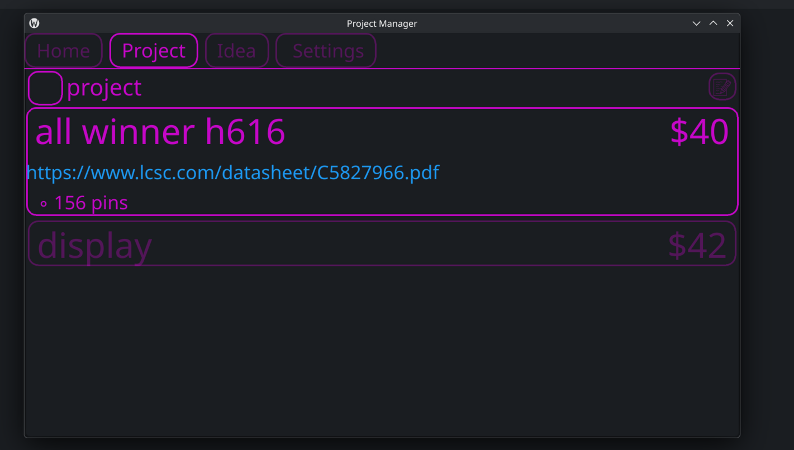
* this is meant for hardware it can store all the parts you need for your project
* it stores several things
  * name
    * just the name of the part
  * link
    * a link to where you can buy the project
    * you cant really open the link, but you can go to the editor and copy it
  * price
    * it stores an int of the price of the part
  * currency
    * you are able to change what currency is it defaults to '$' because its what I use
    * I want to be able to make it so you can change the default
  * values
    * you can store the values of the part so that you can see it 
* you can edit the parts in the edit mode with the "📝" button
* you can add a part with the "+" at the bottom
* you can delete a part with a "-"
* you can add a value with the "+" next to the part
* you cal delete a value with the "-" next to it
### files
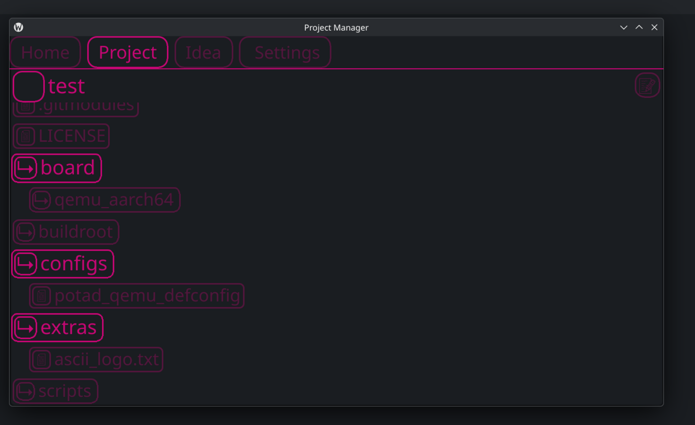
* this part just lets you see your entire projects folders
* you can click on the folders to see what is inside of it
* you can edit the directory with the "📝" button
### calendar
this doesnt work yet
***
## ideas
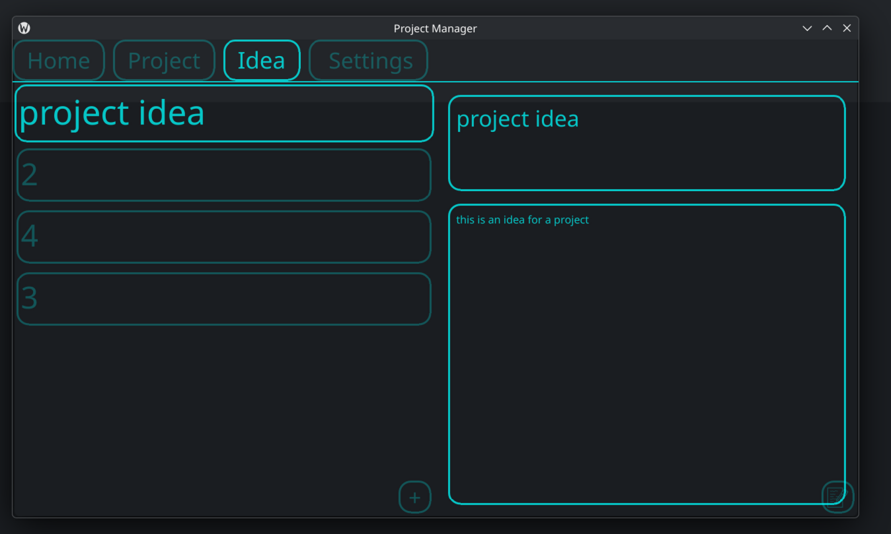<br>
this is to store project ideas that you are not going to build but want to in the future
### name
it's just the name of the project
### description
a description so that you don't forget what the project should do
***
## tools
there is a handful of tools that you can use with the project manager
### list
* this allows you to store a handfull of task to keep on the home screen so you remember what you are doing
* you can add them by clicking the "+" button at the bottom
* they disrepair after you check them off
### note
* there is a note section on the home page
* this will let you just store some things for a seconded
* this will not save after it turns off
### timer
* there is a timer that just works as a normal timer
* you can type a time then you have to reset 
* you can pause and resume
### stopwatch
* at the same place as the timer there is a stop watch 
* there is just a simple pause resume and a reset thing
### clock
there is a clock on the home page and if you click it. it copies the date to your clipboard
### next to the notes there is 8 buttons
they don't do anything because they were ment to be for like bold and italicize but like i don't think I would ever use it so i didn't make it
***
## settings
all the settings is just the color of the ui (hex code) 
***
## technical stuff
### create a project
* after you create a new project you need to go to your root folder
* copy the path to the root folder make sure there is not / at the end and not " " at the beginning
* then make a folder in your root named "managerData" 
* inside of manager data make DATA.json
* inside the JSON wright "{}"
```
  root
  ├── managerData
  │   └── DATA.json
  └── rest of your files
  ```
### save setting
* projects will only save when you close the edit menu
* sometimes you need to open and close the menu a few times for it to load
### json
the JSON that holds thins that are not project is at EngineMod/JSON/DATA.json
### known bugs
* if you add a task/part then try to add a sub-task/value it will crash you need to same the parent first
* if you don't select a project, but you click a page like todo/link etc. or you click edit it will crash
* if a JSON error happens you might need to edit the JSON by hand
### stuff
* qml
* qt
* c++
* json
* cmake
***
## fun facts
* i didn't want to do icons with svgs to I used emojis
* if you click enter on any text box it will save what you are typing 
  * but like only some text boxes ykyk
***
## future
* GitHub
* bom.csv
* open files
* archive
